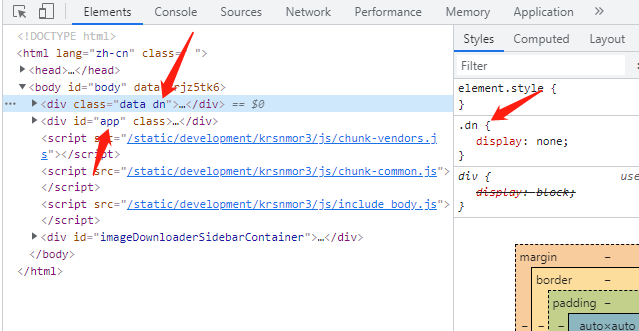

# 总说明

1. 本项目适用范围：   
   1. 必须要考虑 SEO 的
   2. 后端不是 nodejs 或者不能、不想使用 nodejs的
   3. 不想采用 “传统” 前端页面，后端渲染，强耦合一大堆逻辑的
   
2. 本项目，包含了前后端两个项目   
后端项目：wx-tpl   
前端项目：wx-tpl/wx-tpl-front 。[点击前往前端项目说明](./wx-tpl-front/README.md)
3. 本项目采用的思路为前后端各渲染一次模板，编码流程为：   
   1. 前端根据 SEO 需要，编写 html 模板 A 作为数据源
   2. 后端渲染模板 A，并输出
   3. 前端 css 隐藏 A，利用第三方库 [html5parser](https://github.com/acrazing/html5parser)，将 A 解析成 JSON，再次用 Vue 渲染
   4. 图片参考
4. 

## 后端项目说明

1. 后端基于 tp6.0，说明在下方
2. 后端默认移除了 think-trace   
	安装请使用：composer require topthink/think-trace --dev   
	移除请使用：composer remove topthink/think-trace --dev
3. 后端在 config/app.php 中配置了 ENV 常量，   
   在 entry 入口页面中根据不同的 ENV，   
   include 了不同的由前端生成的资源模板。
4. 在 Base.php 中 filterAllView 方法针对模板的最终输出，进行了注释去除、源码压缩 和 针对 a 标签的 网址 添加、删除 nofollow 等

## 其他说明
1. 暂不知此种方法对谷歌 SEO 是否友好，目前默认在渲染完成后，会删除 数据源 A
=============================================

ThinkPHP 6.0
===============

> 运行环境要求PHP7.1+，兼容PHP8.0。

[官方应用服务市场](https://market.topthink.com) | [`ThinkAPI`——官方统一API服务](https://docs.topthink.com/think-api)

ThinkPHPV6.0版本由[亿速云](https://www.yisu.com/)独家赞助发布。

## 主要新特性

* 采用`PHP7`强类型（严格模式）
* 支持更多的`PSR`规范
* 原生多应用支持
* 更强大和易用的查询
* 全新的事件系统
* 模型事件和数据库事件统一纳入事件系统
* 模板引擎分离出核心
* 内部功能中间件化
* SESSION/Cookie机制改进
* 对Swoole以及协程支持改进
* 对IDE更加友好
* 统一和精简大量用法

## 安装

~~~
composer create-project topthink/think tp 6.0.*
~~~

如果需要更新框架使用
~~~
composer update topthink/framework
~~~

## 文档

[完全开发手册](https://www.kancloud.cn/manual/thinkphp6_0/content)

## 参与开发

请参阅 [ThinkPHP 核心框架包](https://github.com/top-think/framework)。

## 版权信息

ThinkPHP遵循Apache2开源协议发布，并提供免费使用。

本项目包含的第三方源码和二进制文件之版权信息另行标注。

版权所有Copyright © 2006-2020 by ThinkPHP (http://thinkphp.cn)

All rights reserved。

ThinkPHP® 商标和著作权所有者为上海顶想信息科技有限公司。

更多细节参阅 [LICENSE.txt](LICENSE.txt)

